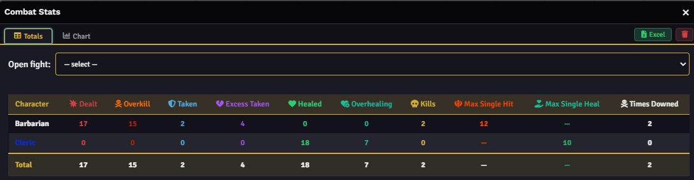
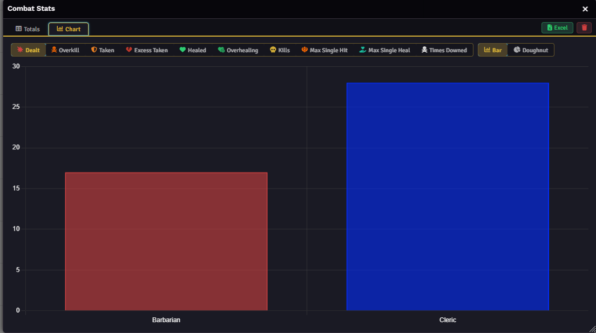
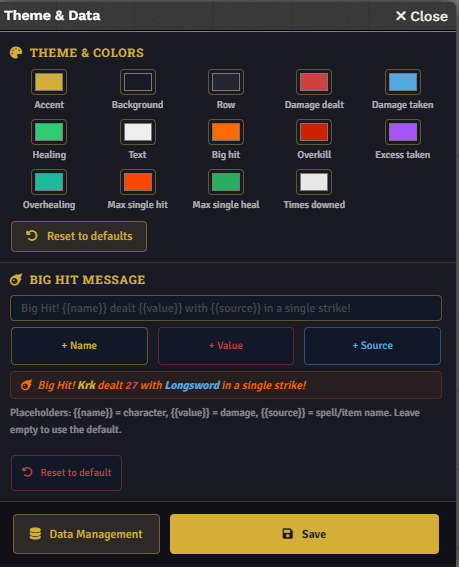

# ⚔️ Combat Stats

> Your party deserves more than a forgotten roll. Combat Stats tracks every hit, heal, and kill, and makes sure no one forgets who carried the fight.


---

## 📸 Screenshots

| Totals Table | Chart View |
|:---:|:---:|
|  |  |
| **End-of-Combat Card** | **Theme & Settings** |
|  |  |

---

## What it does

Combat Stats is a Foundry VTT module for PF2e that automatically tracks combat statistics for every player character, fight by fight, across your entire campaign. When combat ends, a summary card is posted to chat. A dedicated window lets you browse totals, compare characters, and export everything to Excel.

No setup needed, it just runs… or you can customize it to your tastes!

---

## ✨ Features

### 📊 Deep stat tracking

Every fight is recorded with a full breakdown per character:

- **Damage dealt**
- **Damage taken**
- **Healing done**
- **Kills**, **max single hit**, **max single heal**, **times downed**


### 💬 End-of-combat chat card

When combat ends, a styled summary is automatically posted to chat. Columns are configurable independently from tracking: you choose what appears, not what gets recorded. Player names use their Foundry color, and the card adapts to whatever theme you have set.

A **Big Hit achievement** callout highlights the biggest strike of the fight, with a fully customizable message and live preview as you type it.

### 📈 Charts window

A dedicated window (accessible from the scene controls) shows cumulative totals per character across all fights. Switch between any tracked metric with one click, toggle between **Bar** and **Doughnut** views, and export everything to Excel at any time.

Bar and doughnut colors follow each player's Foundry user color automatically.

### 🎨 Full theme customization

11 individually customizable colors covering every stat category, backgrounds, and accents. Changes apply live as you drag the color picker. Reset to defaults at any time.

### 💾 Export and import

- **Export to Excel**: full campaign history as a `.xlsx` spreadsheet
- **Export JSON**: portable fight history you can back up or share
- **Import JSON**: smart merge by UUID (no duplicates) or full replace

### ⚙️ Flexible configuration

- You can choose "who" will write the message in chat for the recap, if default user (Combat Stats) or a specific NPC!
- Every stat can be toggled independently: tracking and chat card visibility are separate settings
- Name display: full name, first name, last name, or Foundry username
- AoE damage and healing can count as a single hit/heal or be evaluated per target for the max hit and max heal trackers
- Players can optionally be granted access to the Charts window

---

## 📦 Installation

### Via Foundry Package Manager (recommended)

1. Open Foundry VTT -> **Add-on Modules** -> **Install Module**
2. Paste the manifest URL:
   ```
   https://github.com/Smantella/combat-stats-pf2e/releases/latest/download/module.json
   ```
3. Click **Install**, then enable the module in your world

### Manual

1. Download the latest release from [GitHub Releases](https://github.com/Smantella/combat-stats/releases)
2. Extract the folder into `Data/modules/`
3. Enable in Foundry -> **Manage Modules**

---

## 🚀 Quick Start

1. Enable the module and reload Foundry (F5)
2. Go to **Game Settings -> Module Settings -> Combat Stats**
3. Run a combat: stats are tracked automatically
4. Give a name to the combat, for the future review!
5. End the combat: a summary card appears in chat
6. Click the **Combat Stats** button in the scene controls to open the Charts window,

---

### Tracked Statistics

**Settings -> Tracked Statistics** has two independent sections:

- **Tracking**: which stats are computed and stored per fight
- **Chat card columns**: which stats appear in the end-of-combat summary

Disabling a stat from tracking also hides it everywhere. Disabling it from the chat card only hides it from the summary; it still gets tracked.

Stats that are not available in the current tracker mode are shown as disabled with a "MidiQOL only" badge, and are automatically hidden from the Charts window and chat card.

### Big Hit Achievement

**Settings -> Theme & Data** includes a Big Hit section where you can configure:

- **Threshold**: minimum damage in a single hit to trigger the callout (default 30, set to 0 to disable)
- **Message**: fully customizable text with `{{name}}`, `{{value}}`, and `{{source}}` placeholders
- **Live preview**: shows a sample message as you type, with a random name, weapon, and damage value

> The names in the preview are not random — they belong to characters from the author's own campaigns.

### Theme & Data

**Settings -> Theme & Data** covers colors, the Big Hit message, and data management (export, import, clear history).

---

## 🔧 Compatibility

| | Version |
|--|---------|
| Foundry VTT | v14+ (tested on 14.364) |
| PF2e | v8.3+|
---

## 🤝 Contributing

Issues and pull requests are welcome. If something breaks or you have an idea, [open an issue](https://github.com/Smantella/combat-stats/issues): I read them.

---

## 📄 License

[Creative Commons Attribution-ShareAlike 4.0](LICENSE): you are free to use and modify this module, but you must credit the original author and distribute any modified version under the same license.

---

*Made by [Smantella](https://github.com/Smantella)* 🏰

## Check also the D&D 5e version [here](https://github.com/Smantella/combat-stats)
